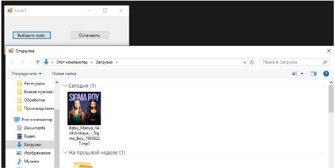

using System;
using System.Collections.Generic;
using System.ComponentModel;
using System.Data;
using System.Drawing;
using System.Linq;
using System.Text;
using System.Threading.Tasks;
using System.Windows.Forms;
using NAudio.Wave;

namespace WindowsFormsApp15
{
    public partial class Form1 : Form
    {
        private IWavePlayer waveOut;
        private AudioFileReader audioFileReader;
        public Form1()
        {
            InitializeComponent();
        }

        private void button1_Click(object sender, EventArgs e)
        {
            using (OpenFileDialog openFileDialog = new OpenFileDialog())
            {
                openFileDialog.Filter = "MP3 Files (*.mp3)|*.mp3";
                if (openFileDialog.ShowDialog() == DialogResult.OK)
                {
                    PlayMp3(openFileDialog.FileName);
                }
            }
        }
        private void PlayMp3(string filePath)
        {
            // Остановить текущее воспроизведение, если оно идет  
            waveOut?.Stop();
            waveOut?.Dispose();
            audioFileReader?.Dispose();

            waveOut = new WaveOut();
            audioFileReader = new AudioFileReader(filePath);
            waveOut.Init(audioFileReader);
            waveOut.Play();
        }

        
        protected override void OnFormClosing(FormClosingEventArgs e)
        {
            waveOut?.Stop();
            waveOut?.Dispose();
            audioFileReader?.Dispose();
            base.OnFormClosing(e);
        }

        private void button3_Click(object sender, EventArgs e)
        {
            if (waveOut != null)
            {
                waveOut.Stop();
                waveOut.Dispose();
                audioFileReader?.Dispose();
                waveOut = null; // Сбрасываем ссылку, чтобы избежать ошибки  
            }
            else
            {
                MessageBox.Show("Ничего не воспроизводится.");
            }
        }
    }
}
