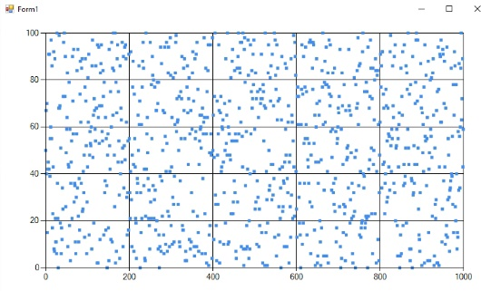

using System;

using System.Windows.Forms;

using System.Windows.Forms.DataVisualization.Charting;

namespace WindowsFormsApp1

{

    public partial class Form1 : Form
	
    {
	
        Random random = new Random();
		
        Chart chart1 = new Chart();
		
        public Form1()
		
        {
		
            InitializeComponent();
			
            chart1.Dock = DockStyle.Fill;
			
            Controls.Add(chart1);
			
            chart1.ChartAreas.Add(new ChartArea("Default"));
			
            chart1.ChartAreas["Default"].AxisX.Minimum = 0;
			
            chart1.ChartAreas["Default"].AxisX.Maximum = 1000;
			
            chart1.ChartAreas["Default"].AxisY.Minimum = 0;
			
            chart1.ChartAreas["Default"].AxisY.Maximum = 100;
			
            chart1.Series.Add(new Series("RandomNumbers"));
			
            chart1.Series["RandomNumbers"].ChartType = SeriesChartType.Point;
			
            GenerateRandomNumbers();
			

        }

        private void Form1_Load(object sender, EventArgs e)
        {

        }
        private void GenerateRandomNumbers()
        {
            
            for (int i = 0; i < 1000; i++)
            {
                int randomNumber = random.Next(101);
                chart1.Series["RandomNumbers"].Points.AddXY(i, randomNumber);
            }
        }

        private void button1_Click(object sender, EventArgs e)
        {
            chart1.Series["RandomNumbers"].Points.Clear();
            GenerateRandomNumbers();
        }
    }
}
