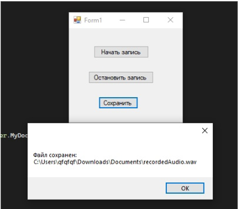

using System;

using System.IO;

using System.Windows.Forms;

using NAudio.Wave;

namespace WindowsFormsApp16
{
    
    public partial class Form1 : Form
    {
	
        private WaveInEvent waveSource;
		
        private WaveFileWriter waveFile;
		
        private string outputFilePath;
		
        public Form1()
        {
		
            InitializeComponent();
        }

        private void button1_Click(object sender, EventArgs e)
        {
            // Укажите путь и имя файла для сохранения  
			
            outputFilePath = Path.Combine(Environment.GetFolderPath(Environment.SpecialFolder.MyDocuments), "recordedAudio.wav");
			

            waveSource = new WaveInEvent();
			
            waveSource.WaveFormat = new WaveFormat(44100, 1); // 44.1 кГц, моно  
			
            waveSource.DataAvailable += OnDataAvailable;
			
            waveSource.RecordingStopped += OnRecordingStopped;
			
            waveFile = new WaveFileWriter(outputFilePath, waveSource.WaveFormat);

            waveSource.StartRecording();
			
            MessageBox.Show("Запись начата...");
        }
        private void OnDataAvailable(object sender, WaveInEventArgs e)
        {
            // Записываем полученные данные в файл  
			
            if (waveFile != null)
            {
                waveFile.Write(e.Buffer, 0, e.BytesRecorded);
				
                waveFile.Flush();
            }
        }

        private void button2_Click(object sender, EventArgs e)
        {
            waveSource?.StopRecording();
			
            MessageBox.Show("Запись остановлена.");
        }
        private void OnRecordingStopped(object sender, StoppedEventArgs e)
        {
            waveFile?.Dispose();
			
            waveSource?.Dispose();
			
            waveFile = null;
			
            waveSource = null;
        }

        private void button3_Click(object sender, EventArgs e)
        {
            if (!string.IsNullOrEmpty(outputFilePath) && File.Exists(outputFilePath))
            {
                MessageBox.Show($"Файл сохранен: {outputFilePath}");
            }
            else
            {
                MessageBox.Show("Файл не записан.");
            }
        }
        protected override void OnFormClosing(FormClosingEventArgs e)
        {
            waveSource?.StopRecording();
			
            waveFile?.Dispose();
			
            base.OnFormClosing(e);
        }
    }
}
