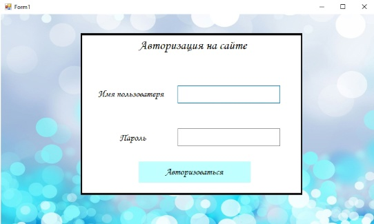
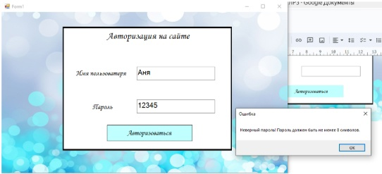
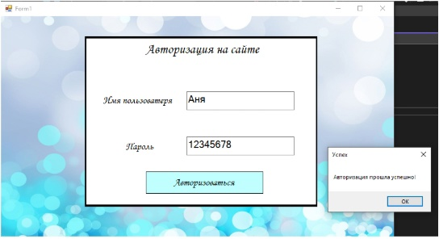

using System;

using System.Windows.Forms;

using System.IO;

namespace WindowsFormsApp4

{

    public partial class Form1 : Form
    {
	
        
        public Form1()
		
        {
		
            
			InitializeComponent();
        }
		

        private void button1_Click(object sender, EventArgs e)
		
        {
            string username = textBox1.Text;
			
            string password = textBox2.Text;

            if (password.Length < 8)
            {
                MessageBox.Show("Неверный пароль! Пароль должен быть не менее 8 символов.", "Ошибка");
            }
			
            else
			
            {
			
                
                string filename = "passwords.txt"; 
				
                string path = Path.Combine(Environment.GetFolderPath(Environment.SpecialFolder.Desktop), filename);
				
                string data = $"{username}:{password}\n"; 

                
                if (File.Exists(path))
                {
                    File.AppendAllText(path, data);
                }
				
                else
				
                {
				
                    File.WriteAllText(path, data); 
                }

                MessageBox.Show("Авторизация прошла успешно!", "Успех");
            }
        }
    }
}
