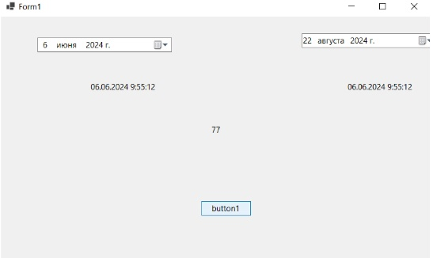

using System;

using System.Collections.Generic;

using System.ComponentModel;

using System.Data;

using System.Drawing;

using System.Linq;

using System.Text;

using System.Threading.Tasks;

using System.Windows.Forms;

namespace test03_2
{

    public partial class Form1 : Form
    {
	
        public Form1()
        {
            
			InitializeComponent();
        }

        private void dateTimePicker1_ValueChanged(object sender, EventArgs e)
        {
            label1.Text = dateTimePicker1.Value.ToString();
        }

        private void dateTimePicker2_ValueChanged(object sender, EventArgs e)
        {
            label2.Text = dateTimePicker1.Value.ToString();
        }

        private void button1_Click(object sender, EventArgs e)
        {
            DateTime startDate;
			
            DateTime finisDate;
			
            int dateStamp;
			
            startDate = dateTimePicker1.Value;
			
            finisDate = dateTimePicker2.Value;
			
            dateStamp = (finisDate - startDate).Days;
			
            label3.Text = dateStamp.ToString();
			

        }
    }
}
