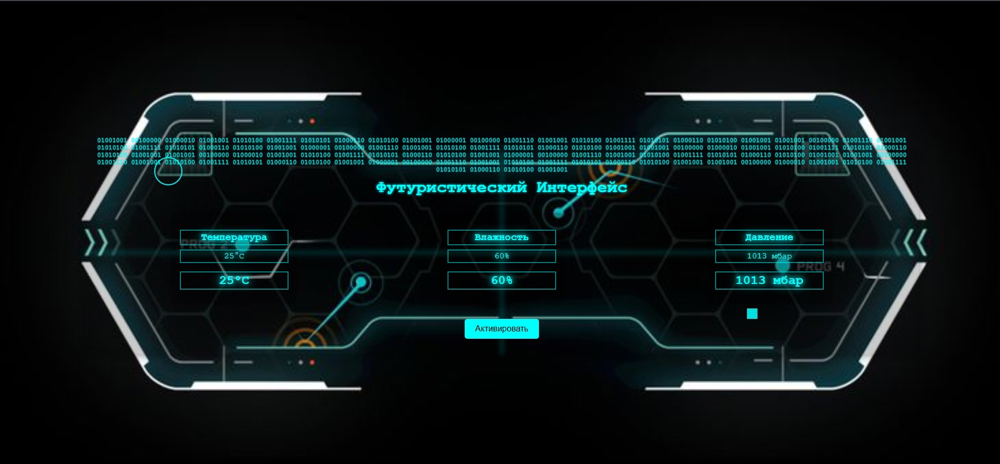

<!DOCTYPE html>

<html lang="en">

<head>

  <meta charset="UTF-8">
  
  <meta name="viewport" content="width=device-width, initial-scale=1.0">
  
  <title>Футуристический Интерфейс</title>
  
  
</head>
<body>

  

    <h1>Футуристический Интерфейс</h1>

    

      

        <h2>Температура</h2>
        
25°C

        
25°C

      

      

        <h2>Влажность</h2>
        
60%

        
60%

      

      

        <h2>Давление</h2>
        
1013 мбар

        
1013 мбар

      

    

    <button>Активировать</button>

    

    

    

    

    <!-- Матричный код -->
    

      01001001 00100000 01000010 01001001 01010100 01001111 01010101 01000110 01010100 01001001
      01000001 00100000 01001110 01001001 01010100 01001111 01010101 01000110 01010100 01001001
      01001001 00100000 01001110 01001001 01010100 01001111 01010101 01000110 01010100 01001001
      01000001 00100000 01001110 01001001 01010100 01001111 01010101 01000110 01010100 01001001
      01001001 00100000 01000010 01001001 01010100 01001111 01010101 01000110 01010100 01001001
	  01001001 00100000 01000010 01001001 01010100 01001111 01010101 01000110 01010100 01001001
      01000001 00100000 01001110 01001001 01010100 01001111 01010101 01000110 01010100 01001001
      01001001 00100000 01001110 01001001 01010100 01001111 01010101 01000110 01010100 01001001
      01000001 00100000 01001110 01001001 01010100 01001111 01010101 01000110 01010100 01001001
      01001001 00100000 01000010 01001001 01010100 01001111 01010101 01000110 01010100 01001001
    

  

</body>
</html>